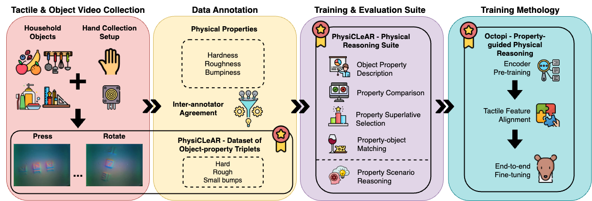

# Octopi: Object Property Reasoning with Large Tactile-Language Models

[](https://arxiv.org/abs/2405.02794)


<p align="center">
  
  <br />
  <span>Fig 1. An overview of the two contributions in this work: 1) PhysiCLeAR: a GelSight tactile video dataset with physical property annotations and a natural language training and evaluation suite. 2) Octopi: a multimodal LLM that is grounded on tactile videos for physical property understanding and scenario reasoning. </span>
</p>

____

This repository contains code for reproducing the experiments presented in "Octopi: Object Property Reasoning with Large Tactile-Language Models". In this paper, our first contribution is **PhysiCLeAR**, a GelSight tactile video dataset with physical property annotations and a natural language training and evaluation suite. 

We further propose **Octopi**, a multimodal LLM that is grounded on tactile signals. It is trained to describe the texture and physical properties of objects based on tactile videos and align its physical understanding with PhysiCLeAR's physical property labels. Octopi is able to use these tactile descriptions for scenario reasoning. Please check out the paper for more details and empirical results.

<p align="center">
  
  <br />
  <span>Fig 2. An overview of the Octopi model. It consists of the tactile encoder (i.e. CLIP's visual encoder), the projection module and the open-source LLM (i.e. Vicuna v1.5). </span>
<p>
  
_____

## Environment and Dataset Setup

* Install libraries:
```bash
pip install -r requirements.txt
```

* Run the following commands:
```bash
$ python utils/process_dataset.py --dataset_path path/to/dataset --output_path path/to/processed/data # Process tactile video dataset into frames and get sample files
$ python utils/generate_qa.py --data_path path/to/processed/data  # Generate question-answer pairs for tactile feature alignment and end-to-end fine-tuning
```


## Using Octopi's Weights
To use Octopi's weights for training and/or evaluation, follow the steps below.

1. Download the required weights (7b and/or 13b) from https://drive.google.com/drive/folders/1AdLCaD_5CiNvsm_cm6IT7KDeXgZVSQlY?usp=sharing.
2. To use them for runs (excluding Encoder Pre-Training), change the following variables in the run's config files.
```yaml
model_type: vicuna-7b # Or vicuna-13b
encoder_path: path/to/encoder.pt
projection_path: path/to/project.pt
tokenizer_path: path/to/tokenizer
llm_path: path/to/llm_weights
```


## Training

For the three main training procedures and two-step scenario reasoning, their respective config files can be found in `configs`.

At the start of each run, you will be prompted to enter an experiment ID for easier identification of experiments. If it is not necessary, leave it blank and press enter.

A folder named after `exps_path` will be created during the runs below if it does not already exist. Logs and model weights for each run will be saved here in individual folders.

### 1) Encoder Pre-Training
```
python train_clip.py
```
```yaml
# general
data_dir: data # Directory containing tactile frames and sample files
cuda: 3
seed: 0
exps_path: exps

# frame processing
flip_p: 0.5 # Probability of horizontal and vertical flips for data processing

# encoder
use_clip: openai/clip-vit-large-patch14 # Pre-trained CLIP to use
num_epochs: 40
lr: 0.001 # Learning rate for any trainable CLIP parameters
classifier_lr: 0.001
batch_size: 2
gradient_accumulation_steps: 2
output_size: 1024 # Embedding output size

# prompt learning
prompt_learning: True # Whether to use learnable prompts or not
num_context_vision: 8 # Length of learnable prompts
prompt_depth_vision: 12 # Number of layers to use learnable prompts
dim_context_vision: 1024
num_context_text: 6
prompt_depth_text: 12
dim_context_text: 768
```


### 2) Tactile Feature Alignment
```
python train_llm.py
```
```yaml
# general
data_dir: data # Directory containing tactile frames and sample files
gpu_config: configs/gpu_config_7b.json # Path to appropriate GPU config file
cuda: 0
seed: 0
exps_path: exps
train: True
val: False
test: True

# frame processing
flip_p: 0.5 # Probability of horizontal and vertical flips for data processing

# encoder
use_vqvae: False
use_clip: openai/clip-vit-large-patch14
freeze_encoder: True
encoder_path: path/to/encoder.pt
encoder_output_size: 1024
num_context_vision: 8
prompt_depth_vision: 12
dim_context_vision: 1024
num_context_text: 6
prompt_depth_text: 12
dim_context_text: 768

# projection
freeze_projection: False
projection_lr: 0.0002
projection_path: null # Initialize an untrained projection module

# LLM
train_files: [/path/to/data/train_qa.json]
val_files: [/path/to/data/val_opd_qa.json]
test_files: [/path/to/data/test_qa.json, /path/to/data/test_opd_qa.json]
model_type: vicuna-7b # Or vicuna-13b
cutoff_len: 512
offload_dir: ./
llm_lr: 0.0002
quantized: False
tokenizer_path: null
llm_path: null
## LoRA
lora_trained: False
use_lora: False # Do not use LoRA for this step
lora_alpha: 256
r: 128
lora_dropout: 0.05
target_modules:
  - q_proj
  - k_proj
modules_to_save:
  - embed_tokens
bias: none
## train
max_train_steps: 10000 # Tactile feature alignment uses 10000 QA pairs by default
save_freq: null
per_device_train_batch_size: 1
llm_gradient_accumulation_steps: 16
warmup_steps: 0.03
## val
per_device_val_batch_size: 1
## generation
max_new_tokens:
  train_object_property_description: 100
  train_object_description: 100
  train_property_comparison: 200
  train_property_superlative_selection: 200
  train_property_object_match: 200
  eval_object_property_description: 100
  eval_property_comparison: 150
  eval_property_superlative_selection: 200
  eval_property_superlative_selection_most: 200
  eval_property_superlative_selection_least: 200
  eval_property_object_match: 200
  eval_property_scenario_reasoning: 200
```


### 3) End-to-End Fine-Tuning
```
python train_llm.py
```
```yaml
# general
data_dir: data # Directory containing tactile frames and sample files
gpu_config: configs/gpu_config_7b.json # Path to appropriate GPU config file
cuda: 0
seed: 0
exps_path: exps
train: True
val: False
test: True

# frame processing
flip_p: 0.5 # Probability of horizontal and vertical flips for data processing

# encoder
use_vqvae: False
use_clip: openai/clip-vit-large-patch14
freeze_encoder: True
encoder_path: path/to/encoder.pt # Your trained encoder
encoder_output_size: 1024
num_context_vision: 8
prompt_depth_vision: 12
dim_context_vision: 1024
num_context_text: 6
prompt_depth_text: 12
dim_context_text: 768

# projection
freeze_projection: False
projection_lr: 0.0002
projection_path: path/to/project.pt # Your trained projection module

# LLM
train_files: [/path/to/data/train_qa.json]
val_files: [/path/to/data/val_opd_qa.json]
test_files: [/path/to/data/test_qa.json, /path/to/data/test_opd_qa.json]
model_type: vicuna-7b # Or vicuna-13b
cutoff_len: 512
offload_dir: ./
llm_lr: 0.0002
quantized: False
tokenizer_path: path/to/tokenizer # NOTE
llm_path: path/to/llm_weights # NOTE
## LoRA
lora_trained: False
use_lora: True # Use LoRA for end-to-end fine-tuning
lora_alpha: 256
r: 128
lora_dropout: 0.05
target_modules:
  - q_proj
  - k_proj
modules_to_save:
  - embed_tokens
bias: none
## train
max_train_steps: 3000 # # End-to-end fine-tuning uses 3000 QA pairs by default
save_freq: null
per_device_train_batch_size: 1
llm_gradient_accumulation_steps: 16
warmup_steps: 0.03
## val
per_device_val_batch_size: 1
## generation
max_new_tokens:
  train_object_property_description: 100
  train_object_description: 100
  train_property_comparison: 200
  train_property_superlative_selection: 200
  train_property_object_match: 200
  eval_object_property_description: 100
  eval_property_comparison: 150
  eval_property_superlative_selection: 200
  eval_property_superlative_selection_most: 200
  eval_property_superlative_selection_least: 200
  eval_property_object_match: 200
  eval_property_scenario_reasoning: 200
```


### Evaluation without Scenario Reasoning
```
python evaluate_llm.py --test_preds_path path/to/test_preds.json
```

## Scenario Reasoning Evaluation
These are currently evaluated manually. The scenario reasoning results will be saved as `test_preds.json` in the experiment folder when you run the following script.

```
python test_two_step.py
```
```yaml
# general
gpu_config: configs/gpu_config_7b.json # Path to appropriate GPU config file
cuda: 0
seed: 0
exps_path: exps

# encoder
use_vqvae: False
use_clip: openai/clip-vit-large-patch14
encoder_output_size: 1024
encoder_path: path/to/encoder.pt # Your trained encoder
num_context_vision: 8
prompt_depth_vision: 12
dim_context_vision: 1024
num_context_text: 6
prompt_depth_text: 12
dim_context_text: 768

# projection
projection_path: path/to/project.pt # Your trained projection module

# LLM
test_files: [/path/to/data/psr_qa.json] # The path to the scenario reasoning QA
model_type: vicuna-7b # Or vicuna-13b
quantized: False
offload_dir: ./
cutoff_len: 256
lora_trained: True # Whether your model was trained with LoRA
tokenizer_path: path/to/tokenizer # Your trained tokenizer
llm_path: path/to/llm_weights # Your trained LLM

# generation
max_new_tokens: 400
```

## Interacting with Octopi
```
python interact.py
```
```yaml
# general
gpu_config: configs/gpu_config_7b.json # Path to appropriate GPU config file
cuda: 0
seed: 0

# encoder
use_vqvae: False
use_clip: openai/clip-vit-large-patch14
encoder_output_size: 1024
encoder_path: path/to/encoder.pt # Your trained encoder
num_context_vision: 8
prompt_depth_vision: 12
dim_context_vision: 1024
num_context_text: 6
prompt_depth_text: 12
dim_context_text: 768

# projection
projection_path: path/to/project.pt # Your trained projection module

# LLM
model_type: vicuna-7b
quantized: False
offload_dir: ./
cutoff_len: 256
lora_trained: True # Whether your model was trained with LoRA
tokenizer_path: path/to/tokenizer # Your trained tokenizer
llm_path: path/to/llm_weights # Your trained LLM

# generation
max_new_tokens: 300
```

### Questions

For any questions regarding the code or the paper, please email [Samson Yu](mailto:samson.yu@u.nus.edu).

### Acknowledgements

This repo contains code that's based on the following repos:

| Repo  | Copyright (c) | License |
| ------------- | ---------- | ------------- |
| [muzairkhattak/ViFi-CLIP](https://github.com/muzairkhattak/ViFi-CLIP)  |  2022 Muhammad Uzair Khattak  | [MIT License](https://github.com/muzairkhattak/ViFi-CLIP/blob/master/LICENSE) |
| [muzairkhattak/multimodal-prompt-learning](https://github.com/muzairkhattak/multimodal-prompt-learning) | 2022 Muhammad Uzair Khattak | [MIT License](https://github.com/muzairkhattak/multimodal-prompt-learning/blob/master/LICENSE) |

### References
- https://jaotheboss.medium.com/domain-training-your-llm-6c77f53e3e27
- https://pub.aimind.so/creating-sinusoidal-positional-embedding-from-scratch-in-pytorch-98c49e153d6